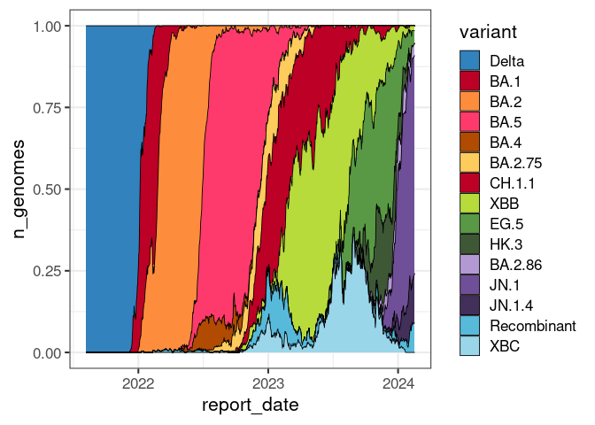

# Prevelence of SARS-CoV-2 Variants of Concern in Aoteoroa New Zealand

The file `data/variant_counts.csv` contains a rolling 7-day average for
the number of genomes from selected SARS-CoV2-2 variants of concern
sequenced from community-acquired cases in New Zealand. This data is
derived from all cases referred to to ESR for sequencing, and not a
randomised sample of all positive cases.

## Example

A brief example of how the data might be used

``` r
library(lubridate)
library(tidyr)
library(ggplot2)

voc <- read.csv("data/variant_counts.csv")
voc$report_date <- ymd(voc$report_date)
tidy_voc <- pivot_longer(voc, !report_date, names_to = "variant", values_to = "n_genomes")
ggplot(tidy_voc, aes(report_date, n_genomes, colour=variant)) + 
    geom_line(size=1.2) +
    theme_bw() + 
    scale_colour_brewer(palette = "Set2")
```

<!-- -->

## License

The data is released under a [CC-BY 4.0 international
license](https://creativecommons.org/licenses/by/4.0/). You are free to
copy, distribute or adapt this data as long as you acknowledge ESR.
